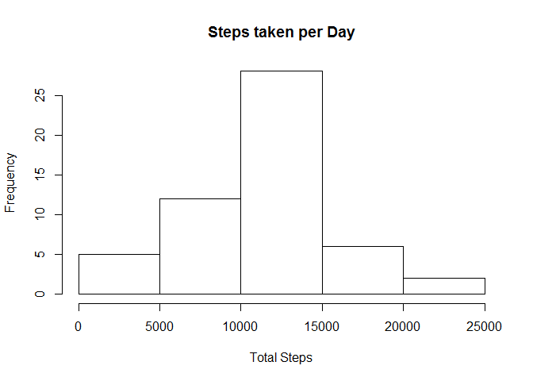
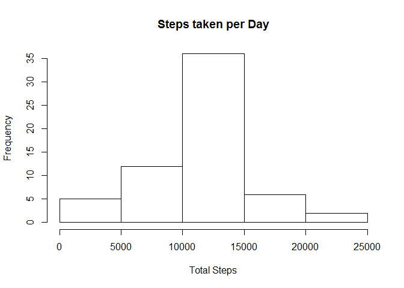
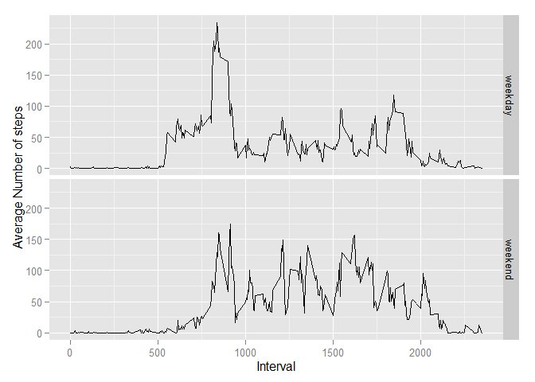

# Reproducible Research: Peer Assessment 1

This assignment makes use of data from a personal activity monitoring device. This device collects data at 5 minute intervals through out the day. The data consists of two months of data from an anonymous individual collected during the months of October and November, 2012 and include the number of steps taken in 5 minute intervals each day.


## Loading and preprocessing the data

Include libraries for plotting (ggplot2) and transforming data (plyr).

```r
knitr::opts_chunk$set(echo=TRUE)
library(ggplot2)
library(dplyr)
options(scipen = 5, digits = 2)
```
Unzip and read the data

```r
data<-(read.csv(unzip("activity.zip"), stringsAsFactors = FALSE))
data$date<-as.Date(data$date, format = '%Y-%m-%d')
```

## What is mean total number of steps taken per day?


First, group the data by date & summarise to get total

```r
steps_byDate<-summarise(group_by(data, date), total=sum(steps))
```

Plot the histogram

```r
hist(steps_byDate$total, main="Steps taken per Day", xlab="Total Steps")
```

 

Calculate the mean & median 

```r
mean_d<-mean(steps_byDate$total, na.rm=TRUE)
median_d<-median(steps_byDate$total, na.rm=TRUE)
```

The mean total number of steps taken per day is **10766.19** and the median is **10765**. 

## What is the average daily activity pattern?

Group the data by interval & calculate the mean

```r
steps_byInterval<-summarise(group_by(data, interval), avg=mean(steps, na.rm=TRUE))
```

Plot the line graph

```r
plot(steps_byInterval, type = "l", xlab="Intervals", ylab="Average Steps per interval", main="Average steps per interval")
```

 

Find the max number of steps & get the 5-minute interval

```r
interval<-steps_byInterval$interval[which.max(steps_byInterval$avg)]
```
On average across all the days in the dataset, the 5-minute interval for **835** contains the maximum number of steps

## Imputing missing values

First, find the total number of missing values

```r
total_na<-sum(!complete.cases(data))
```
There are **2304** missing values

Next, merge data with average from interval to fill in the missing values

```r
nas<-is.na(data$steps)
impute_data<-merge(data, steps_byInterval, by="interval")
impute_data<-impute_data[with(impute_data, order(impute_data$date, impute_data$steps)), ]
impute_data$steps[nas]<- impute_data$avg[nas]
impute_data[,4]<-NULL
```
Summarize the value to find total by date.

```r
steps_byDate2<-summarise(group_by(impute_data, date), total=sum(steps))
```

Draw the histogram

```r
hist(steps_byDate2$total, main="Steps taken per Day", xlab="Total Steps")
```

 

Find the mean & median

```r
mean_im<-mean(steps_byDate2$total, na.rm=TRUE)
median_im<-median(steps_byDate2$total, na.rm=TRUE)
```

The mean total number of steps taken per day is **10766.19** and the median is **10766.19**. 
Both the mean & median is the same if we substitute for missing values.

## Are there differences in activity patterns between weekdays and weekends?

First, create a new col called day to identify if the day is weekend or weekday.

```r
data$day<-ifelse(weekdays(data$date) %in%  c("Saturday", "Sunday"),"weekend","weekday")
```
Next, group the data by interval & day, calulate the mean.

```r
steps_byIntervalDay<-summarise(group_by(data, interval, day), avg=mean(steps, na.rm=TRUE))
levels(steps_byIntervalDay$day) <- c("Weekend", "Weekday")
```

Plot the graph

```r
ggplot(steps_byIntervalDay, aes(x = interval, y = avg)) + geom_line() + facet_grid(day ~ 
    .) + labs(x = "Interval", y = "Average Number of steps")
```

 

From the above graph, it is clear that the average steps is much higher during weekend than weekdays.
